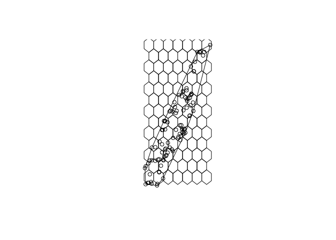
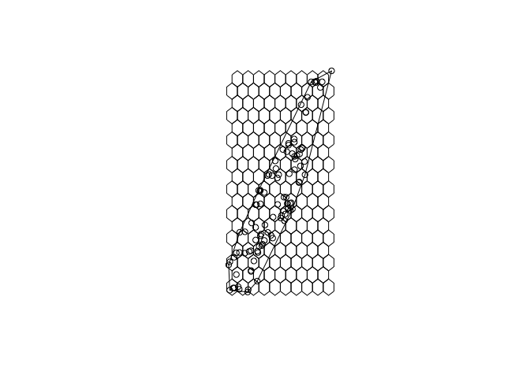
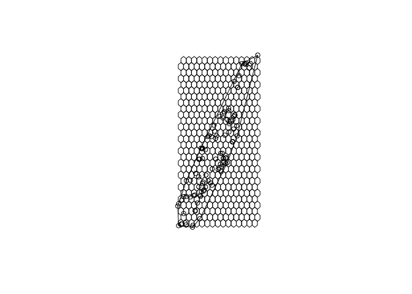
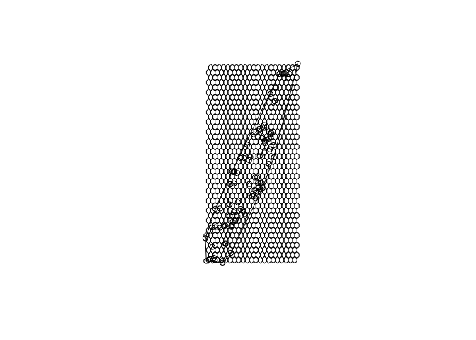

st\_make\_hexagon\_bins
================

``` r
suppressPackageStartupMessages({
  library(sf)
  library(sp)
})

smpl_points <- read_sf("manhattan_sample_points.geojson")
```

Function takes an sf object as input and returns a MultiPolygon sf object.

``` r
st_make_hexagons <- function(x, n = 100){
  set.seed(1)
  hexs <- sf::st_as_sf(sp::HexPoints2SpatialPolygons(sp::spsample(sf::as_Spatial(sf::st_geometry(x)), "hexagonal", n = n)))
  hexs
}
```

``` r
hexs <- st_make_hexagons(smpl_points, n = 100)
plot(smpl_points)
plot(st_convex_hull(st_combine(smpl_points)), add = T)
plot(hexs$geometry, add = T)
```



``` r
hexs <- st_make_hexagons(smpl_points, n = 200)
plot(smpl_points)
plot(st_convex_hull(st_combine(smpl_points)), add = T)
plot(hexs$geometry, add = T)
```



``` r
hexs <- st_make_hexagons(smpl_points, n = 500)
plot(smpl_points)
plot(st_convex_hull(st_combine(smpl_points)), add = T)
plot(hexs$geometry, add = T)
```



``` r
hexs <- st_make_hexagons(smpl_points, n = 1000)
plot(smpl_points)
plot(st_convex_hull(st_combine(smpl_points)), add = T)
plot(hexs$geometry, add = T)
```


